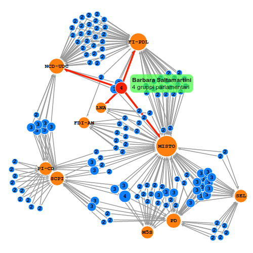

## Introduzione

Recentemente sono venuto a conoscenza della disponibilità di end-point SPARQL sui siti della Camera e del Senato Italiani.
Da qui l'idea di fare dei semplici esperimenti di Data Visualization utilizzando D3.
I motivi sono molteplici, ma spero, tra le altre cose, di aiutare a pubblicizzare questi dataset.

Non essendo un grande fan di Node, per la parte di batch processing ho usato python,
mentre per le visualizzazioni vere e proprie ho creato dei file html con CSS e script
inlined... lo so, è brutto, ma non volevo perdere tempo a fare le cose per bene.

Si consiglia l'utilizzo di Google Chrome per la visualizzazione dei diagrammi in quanto
dotato del motore javascript più veloce.

## Trasformismo in Parlamento

Il primo diagramma mostra i gruppi parlamentari a cui ogni deputato aderisce o a cui ha aderito in passato.
Per rendere più leggero il grafo, sono visualizzati solo i deputati della legislatura corrente
che hanno cambiato gruppo parlamentare almeno una volta.

{: .center }

[(Clicca sull'immagine per aprire la visualizzazione, oppure clicca qui](www/camera.html))

I punti blu rappresentano i singoli deputati, con un raggio crescente al crescere del numero di partiti cambiati.
Passando il mouse sopra di essi viene mostrato il nome del deputato e vengono evidenziate le connessioni
con i partiti.

Nell'esempio è evidenziato il deputato Barbara Saltamartini, che stando ai dati del sito della Camera ha aderito ai
seguenti gruppi parlamentari:

* Nuovo Centrodestra - Unione di Centro
* Forza Italia - Popolo della Libertà
* Lega Nord e Autonomie
* Gruppo Misto

**Nota:** Il nome del gruppo si riferisce alla denominazione attuale, mentre un deputato potrebbe averci aderito
          quando possedeva un nome diverso.

### Query SPARQL

Segue una breve spiegazione delle query SPARQL utilizzate.
Vi prego di segnalarmi se c'è qualche errore o ci sono miglioramenti da fare.

Per semplificare le query all'interno del codice, il file `lib.py` contiene delle funzione di aiuto
che, tra le altre cose, definiscono dei prefissi come `ocd`, evitando quindi di doverli definire
in ogni query.

#### Riferimento della legislatura corrente

La query è molto semplice: si tratta di ordinare le legislature per data decrescente e limitare
il risultato al primo elemento della lista.

~~~python
def load_legislatura():
    return sparql.query("""
    SELECT DISTINCT *
    WHERE
    {
        ?legislatura a ocd:legislatura.
        ?legislatura dc:date ?data.
        OPTIONAL
        {
            ?legislatura dc:title ?titolo.
        }
    }
    ORDER BY DESC(?data)
    LIMIT 1
    """)[0]
~~~

**Nota:** `a` è una versione contratta di `rdf:type`, che serve appunto a imporre un vincolo sul tipo della variabile `?legislatura`.

#### Lista Deputati

La seconda query serve per prelevare i dati di tutti i deputati della legislatura corrente.
Per fare ciò è sufficiente scrivere una query per tutti gli oggetti di tipo `ocd:deputato`,
filtrando poi i risultati relativi a legislature diverse da quella desiderata.

La query viene seguita dall'applicazione della funzione `fix()` che ha il compito di
rendere omogenea la rappresentazione di nome e cognome dei deputati, secondo uno stile
"Nome Cognome" (in partenza era "NOME COGNOME").

~~~python
def load_deputati(legislatura):
    def fix(d):
        d["nome"] = d["nome"].title()
        d["cognome"] = d["cognome"].title()
        return d

    return map(fix, sparql.query("""
    SELECT DISTINCT ?deputato ?cognome ?nome
    WHERE
    {
        ?deputato a ocd:deputato.
        OPTIONAL
        {
            ?deputato foaf:firstName ?nome.
            ?deputato foaf:surname ?cognome.
        }
        ?deputato ocd:rif_leg ?legislatura.

        FILTER (?legislatura = <%(legislatura)s>)
    }
    ORDER BY ?cognome ?nome
    """ % {"legislatura": legislatura}))
~~~

**Nota:** Questa query ritorna più di 630 deputati. Ciò è dovuto al fatto che, ad esempio, non vengono rimossi
          i deputati che hanno rinunciato all'incarico durante la legislatura in corso.

#### Gruppi Parlamentari

Per ottenere i gruppi parlamentari e le loro informazioni, la query è relativamente
simile a quella sopra.

~~~python
def load_gruppi(legislatura):
    return sparql.query("""
    SELECT DISTINCT ?gruppo ?nome
    WHERE
    {
        ?deputato a ocd:deputato.
        ?deputato ocd:aderisce ?adesione.
        ?adesione ocd:rif_gruppoParlamentare ?gruppo.
        ?deputato ocd:rif_leg ?legislatura.
        ?gruppo dc:title ?nome.

        FILTER (?legislatura = <%(legislatura)s>)
    }
    ORDER BY ?nome
    """ % {"legislatura": legislatura})
~~~

#### Adesioni a Gruppi Parlamentari

Questa è forse la query più complessa.
Si parte dal tipo `ocd:deputato`, si impone il filtro sulla legislatura corrente e
poi si ritornano tutte le triple di adesione ai gruppi parlamentari
(`ocd:rif_gruppoParlamentare` è il riferimento che identifica il gruppo parlamentare ottenuto con la query precedente).

~~~python
def load_adesioni(legislatura):
    def cd(x):
        x["inizio"] = lib.parse_date(x["inizio"])
        return x

    return map(cd, sparql.query("""
    SELECT DISTINCT ?deputato ?gruppo ?inizio
    WHERE
    {
        ?deputato a ocd:deputato.
        ?deputato ocd:aderisce ?adesione.
        ?adesione ocd:rif_gruppoParlamentare ?gruppo.
        ?adesione ocd:startDate ?inizio.

        ?deputato ocd:rif_leg ?legislatura.

        OPTIONAL
        {
            ?deputato bio:death ?morte.
            ?adesione ocd:endDate ?fine.
        }

        FILTER (?legislatura = <%(legislatura)s>)
    }
    ORDER BY ?deputato ?gruppo ?inizio
    """ % {"legislatura": legislatura}))
~~~

## lib.py

Questo file è una piccolissima libreria python costruita attorno a [SPARQLWrapper](https://rdflib.github.io/sparqlwrapper/)
e semplifica ulteriormente l'interfacciamento con end-point SPARQL.

### Connessione all'end-point

~~~python
from lib import SimpleWrapper, pretty_print

sparql = SimpleWrapper("http://dati.camera.it/sparql")
~~~

### Stampa Risultati

~~~python
print sparql.query("SELECT DISTINCT ?o WHERE {[] a ?o} OFFSET 50 LIMIT 3")
~~~

Output:

~~~python
[
  {
    "o": "http://dati.camera.it/ocd/componenteGruppoMisto"
  }, 
  {
    "o": "http://dati.camera.it/ocd/elezione"
  }, 
  {
    "o": "http://dati.camera.it/ocd/governo"
  }
]
~~~

### Ispezione Campi

~~~python
sparql.dir("ocd:gruppoParlamentare")
~~~

Output:

~~~python
[
  {
    "t": "http://www.w3.org/1999/02/22-rdf-syntax-ns#type"
  }, 
  {
    "t": "http://www.w3.org/2000/01/rdf-schema#label"
  }, 
  {
    "t": "http://dati.camera.it/ocd/denominazione"
  }
  {
    "t": "http://dati.camera.it/ocd/startDate"
  }, 
  {
    "t": "http://purl.org/dc/elements/1.1/date"
  }, 
  {
    "t": "http://purl.org/dc/elements/1.1/title"
  }, 
  {
    "t": "http://purl.org/dc/terms/alternative"
  }, 
  {
    "t": "http://lod.xdams.org/ontologies/ods/modified"
  }
]
~~~

## Ringraziamenti

Ringrazio l'autore della pagina [Battere Calderoli usando python](http://www.jacquerie.it/battere-calderoli-usando-python),
che mi ha ispirato a fare questo progetto e mi ha informato della presenza di questi dataset.

## Rant

Durante la scrittura delle query ho perso una quantità abbastanza rilevante di tempo perchè:

* Era la prima volta che vedevo SPARQL in vita mia
* SPARQL è un linguaggio abbastana schifoso, con keyword simili all'SQL ma sostanzialmente diverso
* La documentazione sul sito [dati.camera.it](dati.camera.it) è carente
  (non sono riuscito a trovare un qualche diagramma che spiegasse lo schema dei dati)

L'ultimo punto, in particolare, è quello che mi ha spinto a scrivere questo paragrafo.
Spero il problema venga risolto.

## Riferimenti

* [Battere Calderoli usando python](http://www.jacquerie.it/battere-calderoli-usando-python)
* [dati.camera.it](http://dati.camera.it)
* [dati.senato.it](http://dati.senato.it)
